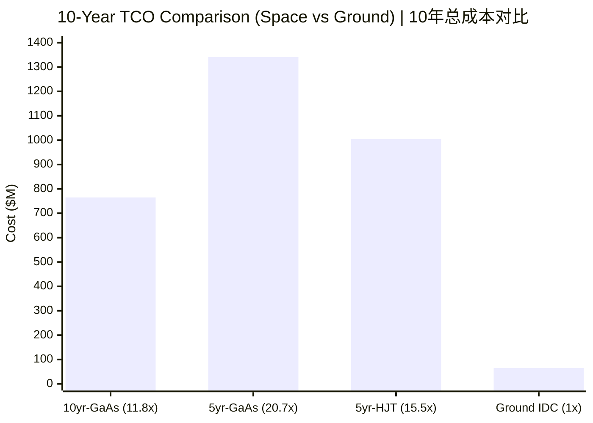
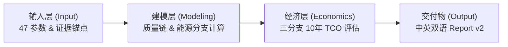

<!-- readme-gen:start:hero -->
<div align="center">

</div>
<!-- readme-gen:end:hero -->

<!-- readme-gen:start:badges -->
<p align="center">
  
  
  
  
</p>
<!-- readme-gen:end:badges -->

---

<!-- readme-gen:start:hook -->
**这是关于“太空算力”的硬核量化分析与原始研究仓库。** 本仓库旨在回答一个核心问题：**SpaceX 提出的 AI1 轨道 AI 数据中心在工程和经济上是否可行？**

### 🎯 核心结论 (Conclusion First)

**物理可行、工程脆弱、商业以场景分层。** 轨道 AI 数据中心的上天成本是地面同等算力的 **11.8 倍**。
- **物理**：斯特藩-玻尔兹曼定律不否定 1 MW 级轨道散热，但该工作点已逼近当前材料天花板，散热密度翻倍在 2035 年前无单一技术路径可支撑。
- **工程**：以 NVIDIA GB300 NVL72 地面硬件为锚点的 bottom-up 质量链给出单星基准质量约 8.48 t。光伏阵列（~55%）和系统裕量（~22%）合计占制造成本的绝大部分，在轨可靠性与维修仍是主要瓶颈。
- **商业**：10 年 TCO 约 **$764.98M / MW**（区间 $0.55B–$1.1B），发射成本仅占 ~1.8%。真正决定商业可行性的因素是光伏阵列成本、在轨寿命和硬件可靠性。HJT 并行路线补齐估计约 $1,005M，且受 70 m 翼展几何排除。

> *This is the original research repository for hardcore quantitative analysis of space-based computing.*  
> **Core Conclusion: Physically feasible, engineeringly fragile, commercially scenario-dependent.** The space deployment cost is **11.8x** that of equivalent ground-based infrastructure.
> - **Physics:** Stefan-Boltzmann law does not preclude 1 MW-class orbital heat rejection, but the operating point is near the material performance ceiling. Doubling heat flux has no single-technology path before 2035.
> - **Engineering:** Bottom-up mass chain anchored on NVIDIA GB300 NVL72 yields a baseline satellite mass of ~8.48 t. PV array (~55%) and system margin (~22%) dominate manufacturing cost. In-orbit reliability and maintenance remain key bottlenecks.
> - **Commercial:** 10-year TCO is ~$764.98M/MW (range $0.55B–$1.1B). Launch cost accounts for only ~1.8% — the real drivers are PV cost, orbital lifetime, and hardware reliability. HJT parallel route yields ~$1,005M (completed estimate) and is geometrically excluded by the 70 m wingspan constraint.

<!-- readme-gen:start:tco_chart -->

<!-- readme-gen:end:tco_chart -->
<!-- readme-gen:end:hook -->

---

## 快速导航 / Quick Navigation

> 建议按以下顺序阅读，快速获取核心信息与研究细节。 / Recommended reading order for quick navigation.

| 顺序 (Order) | 内容 (Content) | 链接 (Link) | 说明 (Description) |
|------|------|------|------|
| 🥇 | **PPT / 幻灯片 (推荐首读)** | [中文版 (CN)](research_output/report_v2/cn/marp/slide.md) / [English (EN)](research_output/report_v2/en/marp/slide.md) | 快速了解核心结论与研究脉络 / Quick overview of key conclusions |
| 🥈 | **Paper / 论文全文** | [中文版 (CN)](research_output/report_v2/cn/latex/main.pdf) / [English (EN)](research_output/report_v2/en/latex/main.pdf) | 详细的科学约束、工程分析与商业评估 / Full scientific, engineering & commercial analysis |
| 🥉 | **原始研究笔记 / Research Notes** | [差异分析 (Gap Analysis)](docs/第二阶段差异分析初步研究.md) / [审计包 (Audit Package)](research_output/workspace/data/stage2_gap_closure_verification.md) | 47 个参数的推导、证据链与原始裁决 / Parameter derivations, evidence chains & verdicts |
| 🏅 | **算法与脚本 / Scripts** | [scripts/](research_output/workspace/scripts/) | 电源系统模型与质量成本经济模型代码 / Power system & mass-cost economic model code |

---

## 仓库结构 / Repository Map

<!-- readme-gen:start:tree -->
```
📦 AI1-轨道数据中心-可行性研究 / Orbital AI Data Center Feasibility Study
├── 📄 第二阶段差异分析初步研究.md     ← 🔴 根目录交付物：全部结论汇总 / Root deliverable: full conclusion summary
├── 📄 AGENTS.md                       ← AC 范式规则入口（AI 代理用） / AC paradigm rules entry (for AI agents)
├── 📂 .trae/
│   ├── 📂 specs/                      ← 全轮次 spec 三件套 / All spec triples across stages
│   │   ├── 📂 research-space-computing/          ← S0: 空间计算研究 / Space Computing Research
│   │   ├── 📂 produce-stage-two-difference-analysis/  ← S1: 差异分析 / Difference Analysis
│   │   ├── 📂 refine-stage-two-blackwell-hjt-model/   ← S2: Blackwell/HJT 深化 / Blackwell/HJT Deepening
│   │   ├── 📂 close-stage-two-evidence-gaps/          ← S3: 证据链硬化 / Evidence Chain Hardening
│   │   ├── 📂 plan-report-two-v2/              ← S4: Report v2 架构规划 / Architecture Planning
│   │   ├── 📂 plan-report-v2-tikz-figures/     ← S5: TikZ 图表生成 / TikZ Figure Generation
│   │   ├── 📂 fix-report-v2-audit-findings/    ← S6: 审计修正 / Audit Fixes
│   │   ├── 📂 plan-report-v2-marp-ppt/          ← S7: Marp 幻灯片 / Marp Slides
│   │   ├── 📂 translate-report-v2-cn-to-en/     ← S8: 中→英翻译 / CN→EN Translation
│   │   └── 📂 research-non-leo-lagrange/        ← 非 LEO 轨道扩展 / Non-LEO Orbit Extension
│   ├── 📂 rules/                      ← AC 范式核心行为规则 / Core behavior rules (rules-0 ~ rules-7)
│   ├── 📂 skills/                     ← 已安装的 AC 范式 Skills / Installed AC Skills
│   └── 📂 documents/                  ← 逐变更留痕与 GN-004 审查记录 / Change logs & GN-004 review records
├── 📂 research_output/
│   ├── 📂 report_v2/                  ← 🆕 Report v2 双语交付物 / Bilingual deliverables
│   │   ├── 📂 cn/
│   │   │   ├── 📂 latex/              ← 中文 LaTeX 论文 / CN LaTeX paper (8 sections + 5 appendices)
│   │   │   └── 📂 marp/               ← 中文 Marp 幻灯片 / CN Marp slides
│   │   └── 📂 en/
│   │       ├── 📂 latex/              ← 英文 LaTeX 论文 / EN LaTeX paper (translated)
│   │       └── 📂 marp/               ← 英文 Marp 幻灯片 / EN Marp slides
│   ├── 📂 latex/                      ← 旧版 LaTeX 论文 / Legacy LaTeX paper
│   ├── 📂 marp/                       ← 旧版 Marp 幻灯片 / Legacy Marp slides
│   ├── 📂 workspace/
│   │   ├── 📂 data/                   ← 证据链审计文档 + JSON 结构输入 / Audit docs & structured inputs
│   │   │   ├── 📄 stage2_gap_closure_verification.md     ← 缺口解除审计包 / Gap closure audit
│   │   │   ├── 📄 stage2_evidence_routing_guide.md       ← 证据路由手册 / Evidence routing guide
│   │   │   ├── 📄 stage2_economic_branches_blackwell.md  ← 三分支经济模型结果 / 3-branch economic results
│   │   │   ├── 📄 stage2_power_system_results_blackwell_hjt.md ← 电源系统结果 / Power system results
│   │   │   ├── 📄 stage2_blackwell_payload_mass_bottom_up.md   ← 计算载荷质量链 / Payload mass chain
│   │   │   ├── 📄 stage2_hjt_evidence_pack.md            ← HJT 并行路线证据包 / HJT evidence pack
│   │   │   ├── 📄 stage2_parameter_admission_registry.md ← 47 参数分级清单 / 47-parameter registry
│   │   │   ├── 📄 stage2_mass_inputs_blackwell_hjt.json  ← 结构化质量输入 / Structured mass inputs
│   │   │   ├── 📄 stage2_cost_inputs_blackwell_hjt.json  ← 结构化价格输入 / Structured cost inputs
│   │   │   └── 📂 _deprecated/                           ← 废弃文件归档 / Deprecated files
│   │   └── 📂 scripts/
│   │       ├── 📄 stage2_power_system_model.py            ← 电源系统模型 / Power system model
│   │       └── 📄 stage2_mass_cost_model.py               ← 三分支经济模型 / 3-branch economic model
│   └── 📂 non_leo_lagrange/           ← 非 LEO 轨道扩展分析 / Non-LEO orbit extension
└── 📂 旧版本report/                   ← 早期实验版 / Early experimental output
```
<!-- readme-gen:end:tree -->

---

## 演进历史 / Evolution History

> 本研究经过多轮核心迭代与补强，目前已演进至 **v2 最终交付版本**。

---

## 数据流 / Data Flow

<!-- readme-gen:start:dataflow -->

<!-- readme-gen:end:dataflow -->

---

## 关键结果 / Key Results

基于 S3 证据链硬化和 Bottom-up 质量推导，当前模型的单星核心指标如下（数据源：[stage2_economic_branches_blackwell.md](research_output/workspace/data/stage2_economic_branches_blackwell.md)）：

| 分支 (Branch) | 电池 (Battery) | 单星质量 (Mass) | 10年总成本 (10-yr TCO) | 状态 (Status) |
|------|------|---------|-----------|------|
| **10年-GaAs (10yr-GaAs)** | 10yr Li-ion NMC | 8.48 t | **$764.98M** | ✅ 推荐基线 (Recommended Baseline) |
| 5年-GaAs (5yr-GaAs) | 5yr NMC | 7.10 t | $1,341.26M | ⚠️ 寿命敏感性对照 (Lifespan Sensitivity) |
| 5年-HJT (5yr-HJT) | 5yr NMC | 9.13 t | ~$1,005M | ⚠️ 补齐估计，无降本优势 (Completed Est., No Cost Advantage) |

---

## 四档证据体系 / Four-Tier Evidence System

<!-- readme-gen:start:health -->
| 档位 (Tier) | 名称 (Name) | 入模条件 (Condition) | 参数数 (Count) | 示例 (Example) |
|------|------|---------|--------|------|
| **一档 (T1)** | 物理推导链 (Physics) | 直接入模，写清公式 | 5 | Stefan-Boltzmann 散热面积推导 |
| **二档 (T2)** | 权威资料 (Authority) | 首次引用 → AskUserQuestion | 7 | NVIDIA GB300 NVL72 官方规格；AzurSpace 4G32 |
| **三档 (T3)** | 可迁移证据 (Transferable) | 首次引用 → AskUserQuestion | 17 | Starlink 电池工程实践 → AI1；HJT 地面量产 → 空间 |
| **四档 (T4)** | 合理推断 (Inference) | 首次引用 → AskUserQuestion | 14 | PCDU 比功率（Terma 飞行产品外推） |
| **禁止 (Banned)** | 无支撑 (No Support) | 永不入模 | 1 | 旧 battery_cost_per_kwh $400/kWh（数量级矛盾） |
| **废弃 (Deprecated)** | 已替换 (Replaced) | — | 3 | kW/t 反推链；HJT 旧路线标签 |
<!-- readme-gen:end:health -->

---

## 废弃资料 / Deprecated Files

本仓库已将过时文件归档至 [`research_output/workspace/data/_deprecated/`](research_output/workspace/data/_deprecated/)。该目录含独立 README 说明废弃原因与替代文件。**任何新工作不应引用 `_deprecated/` 中的文件。**

---

<!-- readme-gen:start:footer -->
<p align="center">
  <sub>全轮次 S0-S8 已闭合 · 中英双语 Report v2 已交付 · 30/30 checklist 通过</sub><br/>
  <sub>trace-id: readme-update-report-v2-20260615-01</sub>
</p>

<div align="center">

</div>
<!-- readme-gen:end:footer -->
